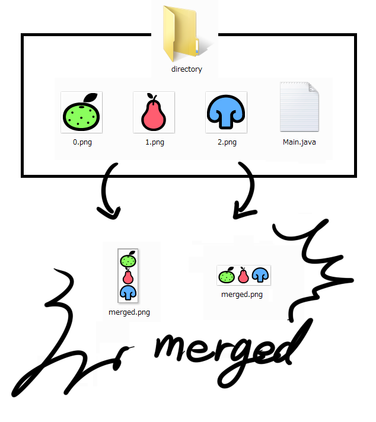

# mergeIMG
複数のpng画像をひとつのファイルに統合する。
  
実行ファイルとn.png(n=0,1,2,...)は同じディレクトリに置く。  
横に並べる場合、統合後の画像の高さは0.pngに合わせる。  
縦に並べる場合、統合後の画像の横幅は0.pngに合わせる。  

## 実行
実行時に以下の形式で入力を与える。  
>"N M"  
N : 画像ファイル数  
M : 統合方式（横に並べる : 0 / 縦に並べる : 1）

## 実行例
>javac Main.java  
>java Main  
>input:10 0  
  
10枚の画像(0.png～9.png)を横に並べる。